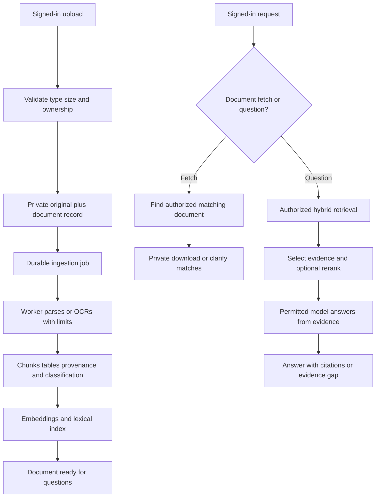

# Broski — MVP and Implementation Plan

Version: 0.2 · Updated: 22 September 2026  
Repository: `git@github.com:Ashishs1991/Broski.git`  
Local checkout: `/Users/ashish/Code/Broski`

## 1. Product contract

Broski is a personal document assistant with two equal responsibilities:

1. **Find and return the original document.** “Send me my Aadhaar” returns a private download inside Broski, after resolving the authenticated owner's document. If more than one matches, ask which one.
2. **Answer from document evidence.** “What does my policy cover?”, “Does it cover this situation?”, and “What are the policy limits?” retrieve the relevant clauses and values and cite their sources.

The deployable MVP includes books, notes, insurance policies, house deeds, and identity documents, including scanned inputs. It is not just a chatbot over text PDFs. The earlier plan deferred OCR and production identity; those are now **required before the MVP release**.

“Send” initially means deliver the file to the authenticated user in the app. Email/WhatsApp delivery and sending to third parties are separate actions and not part of this interpretation.

The initial deployment serves one owner. Every document still has trusted ownership, and access tests use at least two identities to catch cross-user leaks.

## 2. Stack decisions

| Layer | Choice | Why / implementation boundary |
|---|---|---|
| Web interface | React + TypeScript + Vite | Uploads, processing states, document library, chat, citations, and private download actions; responsive browser app |
| API | Python 3.11 + FastAPI | Document endpoints, retrieval, model orchestration; one application rather than microservices |
| Database | PostgreSQL 17 + pgvector | Documents, ownership, chunks, vectors, and durable ingestion jobs in one database |
| DB access | Psycopg; SQL migrations as tables are added | Direct transactions and explicit schema without a generic persistence framework |
| Parsing/OCR | Docling with a local OCR engine | Process supported PDFs, scans, images, and DOCX with source structure; benchmark the configured engine on the corpus |
| Lexical retrieval | PostgreSQL full-text search as first baseline | Complement vectors for terms/identifiers; measure tokenization before claiming exact-ID behavior |
| Jobs | Separate Python worker claiming durable PostgreSQL jobs | OCR/books must not run in the upload request; bounded retries and recoverable leases; no Redis/Kafka dependency initially |
| Original storage | Protected local volume in development; private object storage for deployment | Keep originals independent of extracted text; authorize file delivery; no public bucket |
| Login | Managed OIDC login, with Supabase Auth as the proposed hosted option | Verify issuer/audience/signature and derive owner server-side; final hosting choice follows privacy/deployment preference |
| Embeddings / answer model | Provider choice pending processing preference | No private content goes to an external provider until permitted; select models against quality, language, and budget tests |
| Packaging | Docker Compose for local API/database/worker; static frontend plus API/worker and persistent services for deployment | Hosting target is still to be selected; current Compose is local-development only |
| Verification | pytest/API checks plus a small document-and-question evaluation set | Prove access, lifecycle, retrieval, and answer behavior, not only happy-path responses |

The frontend needs a compatible Node runtime (planned Node 22.12+); this host currently has Node 18. No global runtime was changed during T01. Docling/OCR packages and models will be installed in the worker phase, not in the lightweight API foundation.

Hosted identity/object-storage service creation is not part of T01. If all processing/storage must remain private, settle the corresponding deployment and model choices before integration; the current foundation contains no cloud calls.

## 3. Supported-input contract

| Input | MVP commitment |
|---|---|
| Digital PDF | Extract text, layout, tables, and page provenance where available |
| Scanned PDF | OCR, preserve source page, expose processing failure/uncertainty |
| JPEG/PNG scans | OCR and link extracted evidence to the original image |
| Word `.docx` | Parse text/tables with section provenance; do not invent stable page numbers |
| Markdown / plain text notes | Preserve headings/content and source location |
| Books | PDF/DOCX or supported text export, within explicit file/page limits |
| Online documents | Export-and-upload PDF/DOCX is the provisional route; direct Google Docs/Drive import is awaiting clarification |
| Legacy `.doc`, unusual formats, encrypted PDFs, poor handwriting | Clearly report unsupported or unreadable content; conversion or user assistance may be needed |

“Can contain anything” is the product aspiration, not a guarantee of perfect extraction. Publish the supported format/language/size limits and expand them based on representative documents. Do not silently mark unreadable scans as ready. English printed text is the initial evaluation baseline; confirm required Indian languages and handwriting support before calling them supported.

Proposed initial upload limit: 50 MiB per file, configurable. Determine page and processing limits after testing book-sized files; reject over-limit inputs clearly before expensive processing. Library upload limits are an application concern, not a model context limit.

## 4. Evidence behavior for insurance and personal facts

Policy answers should locate the actual policy and relevant schedule/endorsements, then state:

- What the source supports about the requested coverage.
- Relevant amounts, currency, units, deductibles, sublimits, waiting periods, exclusions, and dates when present.
- The document and page/section supporting each important statement.
- What remains unknown because a clause is ambiguous, unreadable, or missing.

Do not infer approval of a claim merely from a general coverage clause. Distinguish a brochure from the user's schedule and ask for missing documents when needed. If sources conflict or multiple policies match, clarify and cite the conflict. For a value, preserve what the source says instead of inventing a normalized amount.

Aadhaar/file lookup can use user-confirmed document type and metadata. It does not require feeding the full identity document to a model just to return the file. Ownership is always derived from trusted identity, never from the query text or classifier.

## 5. MVP architecture

Polling is not necessary for user uploads. Add it for an external source that needs synchronization. Durable background jobs **are** needed inside the MVP because OCR and large books can take time. No graph database or general-purpose agent framework is needed for the requested first release.

## 6. Tasks in build order

### T01 — API/database foundation (current task)

Deliver: minimal FastAPI application; `/health/live`; database/pgvector `/health/ready`; local Docker Compose; dependency pins; tests; environment template; data/secret exclusions; this revised plan and run instructions.

Acceptance: API tests pass; liveness is independent of database health; readiness fails without usable configuration/pgvector; responses do not leak database error details. Live Compose/DB verification requires a running Docker daemon.

Status: API implementation and tests prepared. Docker runtime integration remains unverified because the local daemon is unavailable. This task does not implement uploads or claim a deployable app.

### T02 — Authenticated document vault and initial interface

Deliver: login/session boundary, trusted owner, document registry/schema, private originals, validated upload, list/detail/download/delete, user-editable title/type (book, note, policy, deed, identity, other), React library view, and visible status. Use synthetic examples until sensitive-data controls are verified.

Acceptance: upload a synthetic Aadhaar/PDF, find it in the library, and download the same original bytes. Another identity cannot list, retrieve, or download it. Validate actual file content rather than trusting extension/MIME alone. Apply request/body limits, protect paths, and keep credentials and files out of Git.

Deletion first makes the record inaccessible, then cleans derived artifacts through recoverable work. Define cleanup/retry behavior so a failed storage delete never leaves an accessible orphan.

### T03 — Background ingestion, multi-format parsing, and OCR

Deliver: durable jobs with attempts/leases, one worker, processing states, Docling/OCR configuration, size/page/time limits, structured chunks, original provenance, checksum/version tracking, safe retry and restart. Parse untrusted files in a constrained worker with no unnecessary credentials/network access.

Acceptance: process fixtures for digital PDF, scanned PDF, DOCX, notes, a table, and an image. Preserve cited pages/sections. A corrupted/unreadable file becomes a visible failure, not ready. Kill/restart a worker and verify recovery without duplicate active chunks. OCR uncertainties are surfaced and checked on a labeled sample.

States: `uploaded → queued → processing → ready`, or `failed`; `deleted` blocks every read path. Classification uncertainty can request confirmation rather than silently label a deed as an insurance policy.

### T04 — Vector retrieval and evidence inspection

Deliver: owner-scoped chunks and vectors, embedding version tracking, compatible query embeddings, lexical baseline, evidence inspection, and ingestion-to-index readiness publication. Model provider integration depends on the processing choice.

Acceptance: known questions retrieve the expected evidence; retrieval never returns another user's content; updated/deleted documents are no longer eligible; records survive restart. Publish baseline results on the evaluation set before adding a reranker.

### T05 — Chat: return files and answer policy questions

Deliver: document-fetch versus question routing, metadata-assisted matching, source selection, grounded answer generation, cited pages/sections, ambiguity handling, insufficient-evidence response, and a minimal chat UI with download cards.

Acceptance: “send me my Aadhaar” returns the selected original, not a generated substitute. Ask about insurance coverage/limits and verify the answer against policy clauses and tables. Missing exclusions/schedules or unreadable values lead to qualified answers or requests for evidence. No fabricated citations.

### T06 — Private deployable MVP

Deliver: chosen hosting, HTTPS, production session validation, private persistent storage, backup/restore, tested document deletion, bounded model spend and retries, redacted operational traces, prompt-injection checks, secrets management, and reproducible release instructions.

Acceptance: complete the release checklist below in the hosted environment using synthetic data; then use personal documents under the agreed processing policy. Test restart/recovery and access isolation. The requested MVP is complete only after this task, not after the API skeleton or a happy-path chat demo.

### After MVP

Direct source connectors/polling (unless requested as a release requirement), more formats/languages, richer policy comparison, cache optimization, advanced reranking, email/calendar actions, GraphRAG, and multi-region scale. Add these in response to measured use cases.

## 7. Release acceptance checklist

- [ ] Login and current owner authorization across library, chat evidence, downloads, citations, and deletion.
- [ ] Original file returned for the correct synthetic identity document; ambiguous matches prompt a choice.
- [ ] Books, notes, policies, and deed samples upload within published limits.
- [ ] Digital PDF, scanned PDF, DOCX, Markdown/text, JPEG, and PNG processing tested.
- [ ] Long-running ingestion shows progress and recovers after a worker restart.
- [ ] Policy coverage/amount questions cite supporting passages and retain exclusions/qualifiers.
- [ ] At least 20 labeled questions covering facts, tables, exclusions, multiple documents, missing evidence, file retrieval, and access-denied cases; review failures before release.
- [ ] No unsupported claims on the curated missing-evidence cases; record retrieval and answer-quality results separately.
- [ ] Original files, parsed content, embeddings, keys, and private traces excluded from Git/public storage.
- [ ] Edits/deletions remove stale evidence; backup/restore and service restart exercised.
- [ ] Processing-provider choice and allowed data flow documented; private content is not sent to unapproved services.
- [ ] HTTPS deployment, request/model limits, latency/cost measurements, and clear unsupported-input errors.

Numeric quality/latency targets will be agreed after fixture benchmarking. A single canned example is not proof that all insurance questions or arbitrary scans work.

## 8. Open inputs that do not block T01

1. **Model/privacy preference:** relevant excerpts to an explicitly approved cloud provider, or entirely local/private processing? This also determines embedding deployment.
2. **Online documents:** export-and-upload acceptable, or direct Google Drive/Docs import required for this MVP?
3. Confirm languages and whether handwritten pages must be supported.
4. Select the private deployment host, identity service, and storage region before production integration.

No external services, provider accounts, or public deployment were created by T01. No real document contents are required for the foundation task.

## 9. Progress and decision history

- 21 September: repository cloned and broad phase plan drafted.
- 22 September: user defined the deployable MVP. OCR, private file return, and personal-policy Q&A moved inside release scope; durable jobs moved ahead of model answering.
- T01: runnable API foundation and local database configuration added; tests and live-integration status are recorded in README.
- Next implementation task: **T02, the authenticated document vault**, followed by OCR ingestion. Resolve the two open processing/import questions before their dependent integrations.

## 10. Primary documentation checked for the stack

- [FastAPI file uploads](https://fastapi.tiangolo.com/tutorial/request-files/)
- [Docling supported formats](https://docling-project.github.io/docling/usage/supported_formats/) and [OCR overview](https://docling-project.github.io/docling/)
- [pgvector](https://github.com/pgvector/pgvector)
- [Vite runtime requirements](https://vite.dev/guide/)
- [Supabase private storage behavior](https://supabase.com/docs/guides/storage/buckets/fundamentals), if selected for hosted storage

These sources establish component capabilities, not measured Broski compatibility; the configured parser and infrastructure still need fixture/integration checks.
